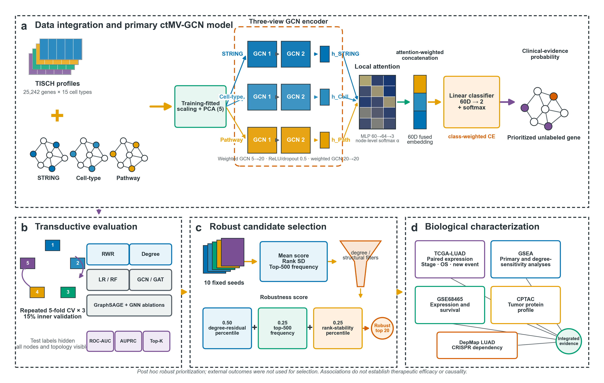

# ctMV-GCN: cell-type-informed multiview graph learning for LUAD gene prioritization

[](https://www.python.org/)
[](LICENSE)
[](https://github.com/lhyzyt2001/scTDA-GCN-LUAD/releases/tag/v1.0.1)
[](https://doi.org/10.5281/zenodo.21805985)

This repository contains the analysis code and publication-level derived results for:

> **ctMV-GCN: cell-type-informed multiview graph convolution for lung adenocarcinoma gene prioritization—a transductive computational study**

ctMV-GCN denotes a **cell-type-informed multiview graph convolutional network**. It integrates cell-type-resolved lung adenocarcinoma (LUAD) expression features with three disease-independent gene-network views:

The historical repository slug `scTDA-GCN-LUAD` is retained to preserve existing links and the v1.0.0 archive; **ctMV-GCN is the official model name from v1.0.1 onward**.

1. high-confidence STRING functional associations;
2. similarity of 15 TISCH cell-type expression profiles; and
3. weighted shared KEGG pathway membership.

Each view is encoded by a two-layer graph convolutional branch. Node-specific local attention combines the three embeddings, and a class-weighted two-class cross-entropy loss predicts whether a gene has LUAD clinical-stage evidence in Open Targets.



## Important interpretation

This repository retains all strong comparators and negative validation results.

- The endpoint is Open Targets clinical evidence (`maxClinicalTrialPhase > 0`), not causal target validity.
- Evaluation is **transductive** repeated five-fold cross-validation with three repeats. Outer-test labels are hidden, but all nodes and disease-independent topology remain visible.
- Random walk with restart (RWR) and a network-degree logistic model outperform the proposed GNN in the primary benchmark.
- Degree-aware analyses show a small residual advantage over degree alone, but also show that topology explains a substantial part of the GNN score.
- External survival associations do not replicate after false-discovery-rate correction.
- No robustness-aware candidate meets the prespecified DepMap LUAD functional-dependency rule.

The defensible use of ctMV-GCN is therefore transparent computational prioritization and hypothesis generation, not proof of therapeutic efficacy.

## Primary results

The graph contains 25,242 genes, including 1,184 Open Targets-positive genes (4.69%). Values below are mean ± standard deviation across 15 outer folds.

| Method | ROC-AUC | AUPRC |
|---|---:|---:|
| RWR on STRING | 0.933 ± 0.006 | 0.439 ± 0.032 |
| Network-degree logistic | 0.888 ± 0.008 | 0.318 ± 0.021 |
| ctMV-GCN, local attention + class-weighted CE | 0.851 ± 0.015 | 0.215 ± 0.033 |
| PPI-GraphSAGE + nnPU | 0.761 ± 0.029 | 0.155 ± 0.021 |
| Random forest | 0.706 ± 0.016 | 0.122 ± 0.011 |
| Logistic regression | 0.653 ± 0.021 | 0.110 ± 0.011 |
| PPI-GAT + nnPU | 0.728 ± 0.083 | 0.103 ± 0.027 |
| PPI-GCN + nnPU | 0.675 ± 0.020 | 0.074 ± 0.009 |

The legacy `PPI-*` labels in output tables refer to the STRING functional-association view; STRING edges are not described as strictly physical interactions.

## Repository layout

```text
.
├── README.md
├── CITATION.cff
├── LICENSE
├── .zenodo.json
├── data/
│   └── README.md                 # required raw-input layout and download sources
├── docs/
│   ├── DATA_SOURCES.md           # accessions, versions and redistribution boundary
│   └── RESULTS_INDEX.md          # map from manuscript claims to result files
├── results/                      # frozen derived outputs supporting the manuscript
│   ├── 00_workflow/
│   ├── 01_data/
│   ├── 02_benchmark/
│   ├── 03_model/
│   ├── 04_topk/
│   ├── 05_interpretability/
│   ├── 06_tcga/
│   ├── 07_validation/
│   └── 08_robustness/
└── src/
    ├── 1.1_ppi.py ... 5.2_framework_schematic.py
    ├── models.py
    ├── experiment.py
    ├── config.py
    ├── config.local.example.json
    ├── requirements.txt
    ├── check_inputs.py
    └── run_all.py
```

Raw third-party data, patient-level working tables, trained weights and intermediate graph tensors are intentionally not redistributed. See [data/README.md](data/README.md) and [docs/DATA_SOURCES.md](docs/DATA_SOURCES.md).

## Installation

Python 3.11 is recommended.

The manuscript release was executed and validated with Python 3.11.3, PyTorch 2.6.0 (CPU build) and Windows 11 build 26200. Exact Python package versions are pinned in `src/requirements.txt`. A GPU is optional; PyTorch/PyTorch Geometric wheels must match the local operating system and CUDA runtime when CUDA is used.

```bash
git clone https://github.com/lhyzyt2001/scTDA-GCN-LUAD.git
cd scTDA-GCN-LUAD
python -m venv .venv
```

Activate the environment, then install the frozen dependencies:

```bash
python -m pip install --upgrade pip
python -m pip install -r src/requirements.txt
```

PyTorch and PyTorch Geometric installation can depend on the operating system, CUDA toolkit and accelerator. If the standard installation fails, install the matching PyTorch build first, then rerun the requirements command.

## Input data

Download the source datasets described in [docs/DATA_SOURCES.md](docs/DATA_SOURCES.md) and place them under `data/core` and `data/external_validation` using the filenames in [data/README.md](data/README.md). Exact byte counts and SHA-256 digests for the study snapshots are provided in [docs/INPUT_CHECKSUMS.tsv](docs/INPUT_CHECKSUMS.tsv).

No source dataset is silently downloaded by `run_all.py`. This keeps the analysis auditable and avoids redistributing third-party data under incompatible terms.

The frozen TISCH-derived 15-cell-type feature matrix and the processed Open Targets label/audit snapshots are included under `results/01_data`. The pipeline uses these packaged snapshots when the corresponding manually prepared source files are absent; all other third-party inputs remain subject to their source access terms.

## Configuration

From the repository root:

```bash
cp src/config.local.example.json src/config.local.json
```

The example configuration points to:

```json
{
  "data_root": "../data/core",
  "source_root": "../data/core",
  "external_data_root": "../data/external_validation",
  "result_root": "../results_final"
}
```

`config.local.json` is ignored by Git because it may contain local paths. The same locations can be set with `CTMV_DATA_ROOT`, `CTMV_SOURCE_ROOT`, `CTMV_EXTERNAL_DATA_ROOT`, `CTMV_RESULT_ROOT` and `CTMV_CONFIG`. The former `SCTDA_*` variables remain accepted as backward-compatible aliases.

Before starting the full analysis, validate the input layout and frozen checksums from the repository root:

```bash
python src/run_all.py --check-inputs
```

The check exits non-zero and identifies every absent or mismatched input. It accepts either the original TISCH/Open Targets inputs or their frozen packaged fallbacks.

## Reproduce the full pipeline

Run from `src` using the activated environment:

```bash
cd src
python run_all.py --fresh
```

`run_all.py` uses `sys.executable`, so every stage runs with the same Python environment. The `--fresh` option is guarded: it deletes only the configured output directory whose final name is exactly `results_final`.

The full run includes:

| Stage | Script | Main purpose |
|---|---|---|
| 1 | `1.1_ppi.py`–`1.5_data.py` | construct graph views, labels and graph dataset |
| 2 | `2.1_compare3.py` | repeated cross-validation and complete benchmark |
| 3 | `2.2_train2.py`, `2.3_predict2.py` | train the ten-seed final ensemble and rank genes |
| 4 | `3.1_top-k3.py` | out-of-fold Top-K recovery |
| 5 | `3.3_biological_validation.py` | degree audit, TCGA paired expression and stage analysis |
| 6 | `4.1_robustness.py` | degree matching, conditional permutation, residualization and edge perturbation |
| 7 | `3.2_analysis3.py` | primary and sensitivity GSEA |
| 8 | `3.4_TCGA3.py` | TCGA overall-survival and new-tumor-event analyses |
| 9 | `4.2_external_validation.py` | GSE68465 and CPTAC characterization |
| 10 | `4.3_depmap_validation.py` | DepMap Public 26Q1 LUAD dependency analysis |
| 11 | `5.1_workflow_figure.py`, `5.2_framework_schematic.py` | publication workflow figures |

GSEA uses 2,000 permutations and is the longest stage. Individual sensitivity analyses can be run separately:

```bash
python 3.2_analysis3.py --analysis primary
python 3.2_analysis3.py --analysis degree_residualized
python 3.2_analysis3.py --analysis hub_structural_filtered
```

## Frozen derived results

The tracked `results/` directory contains publication-level result tables, candidate rankings, out-of-fold predictions, manifests and main figures. It excludes raw inputs and large binary training artifacts. Start with:

- [`results/FINAL_RESULTS_MANIFEST.json`](results/FINAL_RESULTS_MANIFEST.json)
- [`results/02_benchmark/primary_benchmark_summary.csv`](results/02_benchmark/primary_benchmark_summary.csv)
- [`results/02_benchmark/paired_bootstrap_auprc.csv`](results/02_benchmark/paired_bootstrap_auprc.csv)
- [`results/08_robustness/degree_matched_auprc_comparisons.csv`](results/08_robustness/degree_matched_auprc_comparisons.csv)
- [`results/08_robustness/robust_top20.csv`](results/08_robustness/robust_top20.csv)
- [`results/07_validation/robust_top20_integrated_candidate_evidence.csv`](results/07_validation/robust_top20_integrated_candidate_evidence.csv)
- [`results/08_robustness/external_validation/external_validation_with_dependency_summary.csv`](results/08_robustness/external_validation/external_validation_with_dependency_summary.csv)

A manuscript-to-file map is provided in [docs/RESULTS_INDEX.md](docs/RESULTS_INDEX.md).

## Robustness-aware top 20

The post hoc fixed candidate set is:

`CCDC80, LUM, CTSG, MFAP2, FMOD, CFP, PALMD, MASP1, CST2, ACTA2, TREML1, ISLR, APOA2, FCER1A, POSTN, AMBP, C4A, FCN3, PLAC9, LTC4S`.

The robustness score combines degree-residual score percentile (0.50), top-500 frequency across ten seeds (0.25) and inverse rank-standard-deviation percentile (0.25), after the declared hub/structural filters. The rule was developed after degree bias was diagnosed and is not presented as preregistered.

## Reproducibility notes

- Open Targets outer-test labels are excluded from fitting, early stopping, threshold selection and RWR seed construction.
- Scaling and five-component PCA are fitted on training nodes only within each split.
- KEGG is used to construct the pathway graph and is excluded from downstream enrichment to avoid circular validation.
- GSEA retains complete result tables; representative GO-BP tables are supplied only to reduce redundancy for interpretation.
- The 1:1 degree-matched analysis has prevalence 0.5 and random AUPRC 0.5. Its AUPRC must not be compared numerically with the original 4.69%-prevalence benchmark.
- CPTAC tumor protein values use a study-specific zero reference and are not a paired tumor-normal comparison.
- External outcomes are not used to select the robust top 20.

## Citation

Version `v1.0.1` standardizes the descriptive model name as ctMV-GCN and corrects the loss label to class-weighted cross-entropy; no numerical result or experimental design changed. The earlier `v1.0.0` archive, which used the former internal identifier, remains permanently available at [https://doi.org/10.5281/zenodo.21805985](https://doi.org/10.5281/zenodo.21805985). The version-specific DOI for `v1.0.1` will be added to [`CITATION.cff`](CITATION.cff) after Zenodo archives the GitHub release.

## License

Source code is released under the [MIT License](LICENSE). The derived tables and figures remain subject to the terms of their underlying public data sources; raw third-party datasets are not redistributed.

## Contact

Corresponding author: Jihua Feng, `fengjihua@ymu.edu.cn`
